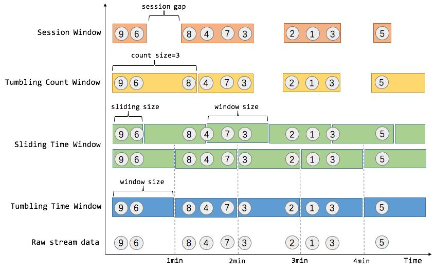
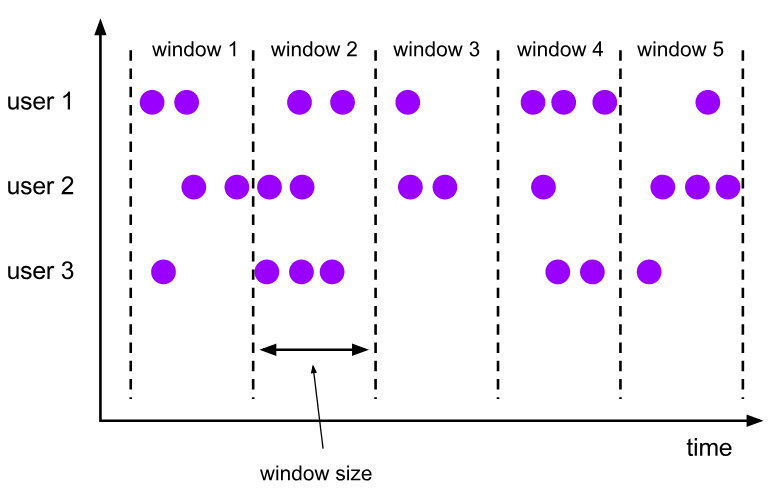
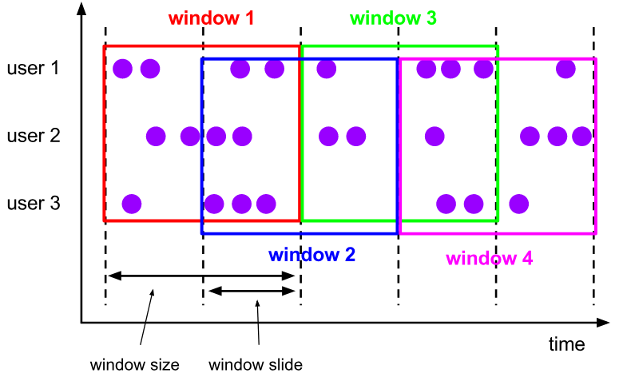
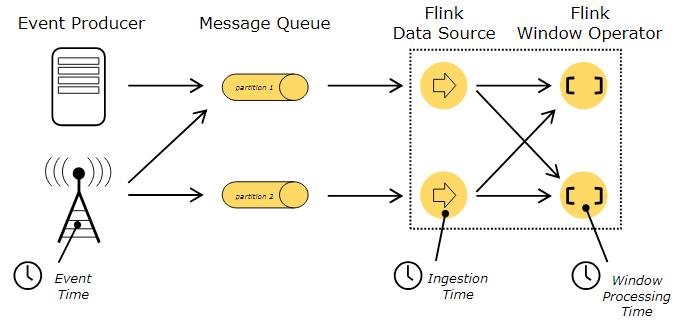
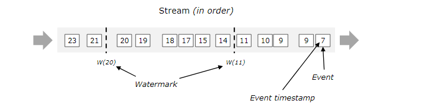
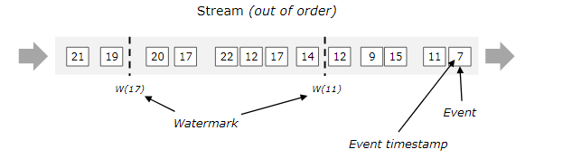

##### Flink简介
    Flink是面向分布式数据流处理和批量数据处理的开源平台。
    2015年1月12日正式成为Apache的顶级项目。
    主要由Java代码实现。
    支持实时流(stream)处理和批处理(batch)，批处理只是流处理的一个极限特例。
    Flink原生支持了迭代计算、内存管理和程序优化。
    

    Flink基本组件：Data Source、Transformations、Data Sink

    spark streaming是一个batch一个batch的处理。
    storm和Flink都是一条一条的处理。

##### 流处理编程
    DataFrame和DataSet：
    Flnik用DataStream表示无界数据集，用DataSet表示有界数据集，前者用于流处理应用程序，后者用于批处理。
    程序结构：
    StreamingExecutionEnvironment和ExecutionEnvironment分别对应流处理和批处理。
    
#### DreamStream API
    keyBy("someKey") ： 指定对象中的 "someKey"字段作为分组key。
    keyBy(0) : 指定Tuple中的第一个元素作为分组key。

##### Flink Window操作
    流是无界的，对流中所有元素进行聚合是不可能的，可以通过window来划定范围。
    窗口可以是 时间驱动(Time Window) 或 数据驱动(Count Window)
    
    window类型：
    tumbling windows ： 滚动窗口(没有重叠)
    sliding windows ： 滑动窗口 (有重叠)
    session windows ： 会话窗口

* Flink窗口
   
* Flink滚动窗口
   
* Flink滑动窗口 
   

##### Flink Time
    Flink Stream数据中的时间，可以分为以下三种：
    Event Time ： 时间产生时间，通常由事件中的时间戳描述。
    Ingestion Time ：事件进入Flink时间。
    Processing Time ： 事件被处理时当前系统的时间。 
    
    在Flink中，默认是 Processing Time。
* Flink时间      
      
    
##### flink watermarks
    用于处理乱序数据。比如上游是kafka，同一个分区内可以保证有序，但是不同分区之间无法保证。
    不排除由于网络延迟等原因，导致数据乱序的产生。
* watermarks有序     
  
* watermarks无序
     

##### flink状态(state)
    state默认指一个具体的task/operator 。 state数据默认存储在java堆内存中。
    task指flink中执行的基本单元，operator指算子transformation。
    
    Flink中有两种基本类型的State
    1.Keyed State
    2.Operator State
    
    可以以两种形式存在：
    1.原始状态：Flink框架管理的状态
    2.托管状态：用户自行管理状态的数据结构
    通常在DataStream上的状态推荐使用托管的状态，当实现一个自定义的Operator时，会使用到原始状态。

##### flink checkpoint
    checkpoint表示flink job在一个特定时刻的一份全局状态的快照，包括了task和operator状态。
    checkpoint是flink实现容错机制最核心的功能，根据配置周期性的基于stream中的各个task/operator的
    状态来生成快照，将这些数据定期持久化的存储下来，当程序崩溃重启可以根据这些快照进行恢复。

