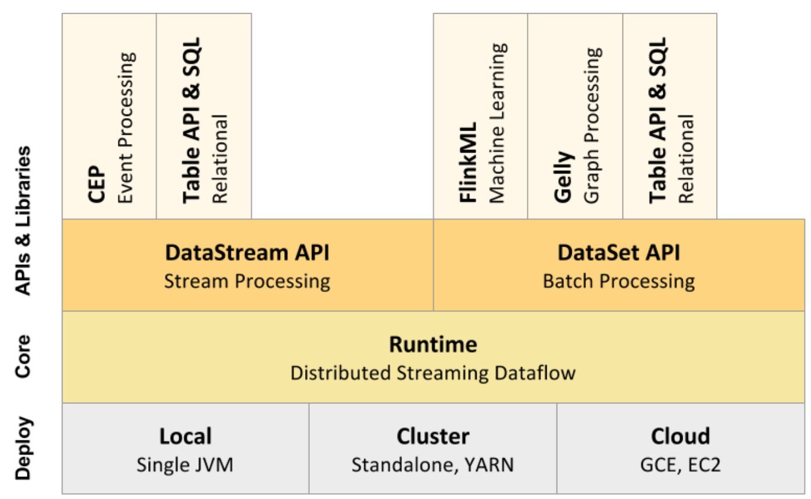

##### Flink简介
    Flink是面向分布式数据流处理和批量数据处理的开源平台。
    2015年1月12日正式成为Apache的顶级项目。
    主要由Java代码实现。
    支持实时流(stream)处理和批处理(batch)，批处理只是流处理的一个极限特例。
    Flink原生支持了迭代计算、内存管理和程序优化。
    

    Flink基本组件：Data Source、Transformations、Data Sink

    spark streaming是一个batch一个batch的处理。
    storm和Flink都是一条一条的处理。

##### 流处理编程
    DataFrame和DataSet：
    Flnik用DataStream表示无界数据集，用DataSet表示有界数据集，前者用于流处理应用程序，后者用于批处理。
    程序结构：
    StreamingExecutionEnvironment和ExecutionEnvironment分别对应流处理和批处理。
    
##### Flink Windows操作

    