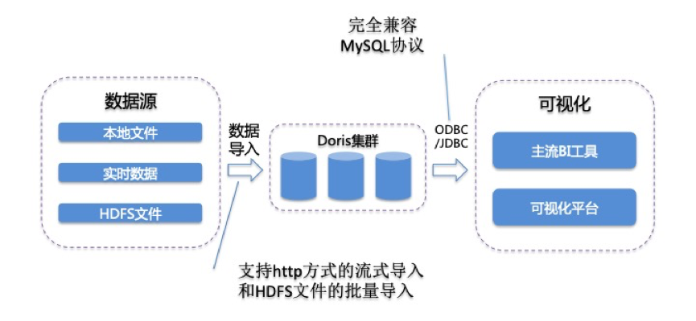

##### 百度开源的,apache孵化项目
    Doris采用mysql协议进行通信，用户可通过mysql client或者JDBC连接到Doris集群。
    
    Doris数据模型上目前分为三类: AGGREGATE KEY, UNIQUE KEY, DUPLICATE KEY。三种模型中数据都是按KEY进行排序。
    
    在 Doris 中，数据以表（Table）的形式进行逻辑上的描述。
    一张表包括行（Row）和列（Column）。Row 即用户的一行数据。Column 用于描述一行数据中不同的字段。
    Column 可以分为两大类：Key 和 Value。从业务角度看，Key 和 Value 可以分别对应维度列和指标列。
    
    Doris目前提供mini load和pull load两种导入方式, 通过指定导入label标示一批次的导入。
    Doris对单批次的导入会保证原子生效, 即使单次导入多张表也同样保证其原子性。
    mini load : 通过http推的方式进行导入, 每次导入数据限制在1GB, 适合分钟级别的数据导入需求。
    pull load : 通过拉的方式导入, 适合天级别的批量数据的导入。

    FE：Frontend，即 Doris 的前端节点。主要负责接收和返回客户端请求、元数据以及集群管理、查询计划生成等工作。
    BE：Backend，即 Doris 的后端节点。主要负责数据存储与管理、查询计划执行等工作。

* [wiki文档](https://github.com/apache/incubator-doris/wiki)  
    
##### 分级存储
    用户可以指定数据放到SSD 上或者SATA 盘上, 也支持根据TTL 将冷数据从SSD 迁移到SATA 上,高效利用SSD 提高查询性能
    
