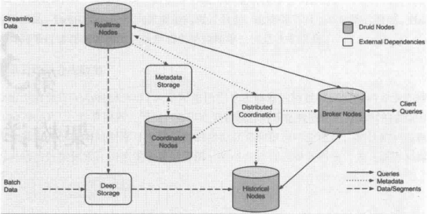

##### 什么是Druid
    Druid是一个分布式的支持实时分析的数据存储系统。能支持“PB”级数据的秒级查询。
    美国广告公司MetaMarkets与2011年创建了Druid项目，于2012年晚期开源了Druid项目。

##### Druid三大设计原则
    快速查询
    水平扩展能力
    实时分析

##### Druid架构
    Druid总体架构图分为以下4类节点：
    实时节点(Realtime Node)：即时摄入实时数据，以及生成Segment数据文件。
    历史节点(Historical Node)：加载已生成好的数据文件，以供数据查询。
    查询节点(Broker Node)：对外提供数据查询服务，并同时从实时节点和历史节点查询数据，合并后返回给调用方。
    协调节点(Coordinator Node)：负责历史节点的数据负责均衡，以及通过规则(Rule)管理数据的生命周期。

    
    元数据库(Metastore)：存储Druid集群的元数据信息，比如Segment的相关信息，一般用Mysql或PostgreSQL。
    分布式协调服务(Coordination)：为Druid集群提供一致性协调服务的组件，通常使用zookeeper。
    数据文件存储(DeepStorage)：存放生成的Segment数据文件，并供历史节点下载，单节点集群可以是本地磁盘，分布式集群一般是HDFS或NFS。
    
    
