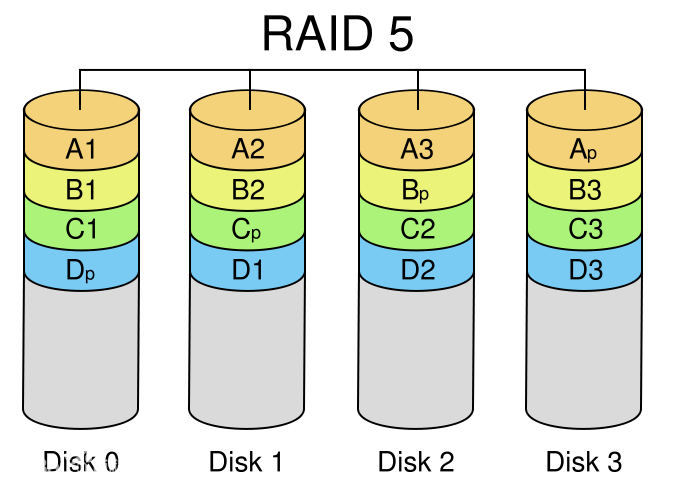

##### Java IO操作相关类和接口
    java.io.File (类)：文件类
    java.io.InputStream（抽象类）：字节输入流
    java.io.OutputStream（抽象类）：字节输出流
    java.io.Reader（抽象类）：字符输入流
    java.io.Writer（抽象类）：字符输出流
    java.io.RandomAccessFile（类）：随机存储文件类

##### 字符流和字节流的区别？
    IO流的分类：根据处理数据类型的不同分为字节流和字符流；根据流方向不同分为输入流和输出流。
    字节流操作的基本单位是字节（8bit）；字符流操作的基本单位是Unicode码元。
    字节流默认不使用缓冲区；字符流使用缓冲区。
    字节流通常用于二进制处理，实际上可以处理任意类型的数据，但不支持直接读取或写入Unicode码元；字符流通常处理文本数据，可以直接读取或写入Unicode码元。
    

##### 什么是缓冲区？
    缓冲区（Buffer）就是内存中预留指定大小的内存空间，用来对I/O数据做临时的存储，这部分预留的内存空间称之为缓冲区。
    1.在创建时候就被分配内存，可以减少动态分配和回收内存次数；
    2.减少实际物理读写次数；

##### 磁盘阵列
    磁盘阵列（Redundant Arrays of Independent Drives，RAID）
    磁盘阵列还能利用同位检查（Parity Check）的观念，在数组中任意一个硬盘故障时，仍可读出数据，在数据重构时，将数据经计算后重新置入新硬盘中。
    RAID0：没有冗余功能，如果一个磁盘（物理）损坏，则所有的数据都无法使用。
    RAID1：磁盘的利用率最高只能达到50%(使用两块盘的情况下)，是所有RAID级别中最低的。
    RAID5：RAID 5不单独指定的奇偶盘，而是在所有磁盘上交叉地存取数据及奇偶校验信息
    

